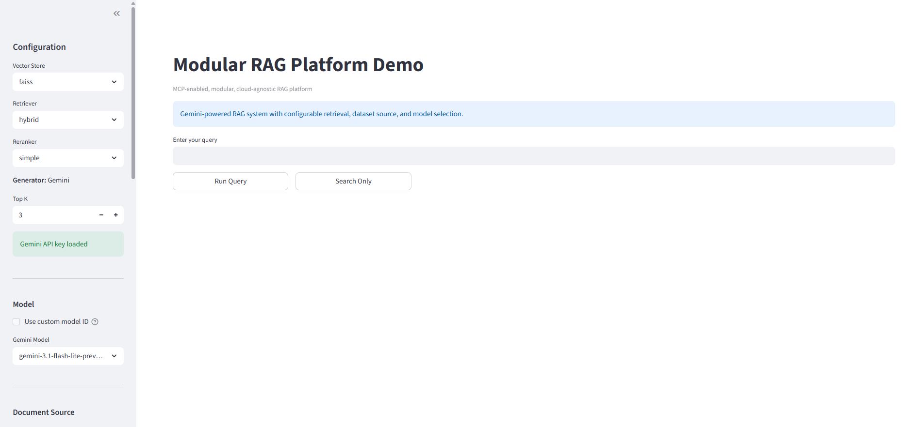

# Modular MCP-Enabled RAG Platform

> A handoff-ready, cloud-oriented Retrieval-Augmented Generation (RAG) platform with Model Context Protocol (MCP) integration, configurable retrieval strategies, evaluation scripts, and Terraform-based deployment support.

This repository contains a modular RAG infrastructure platform developed as part of an internship project. The platform is designed to support protocol-based tool exposure, configurable retrieval and reranking, interchangeable storage backends, reproducible evaluation, and deployment on Google Cloud Platform using Docker and Terraform.

---

## Project overview

The platform is built as a reusable infrastructure layer for document-centric and agentic AI systems. Instead of implementing RAG as a single monolithic script, the project separates retrieval, reranking, generation, MCP tool exposure, storage, evaluation, and deployment into configurable components.

The main system components are:

* **RAG engine** for retrieval, optional reranking, context construction, and answer generation
* **MCP server** for protocol-based tool exposure to external agents and clients
* **Streamlit UI** for interactive validation and demonstration
* **Vector storage abstraction** for switching between vector backends
* **Document ingestion layer** for local and Google Cloud Storage-backed document loading
* **Evaluation module** for retrieval benchmarking and LLM-as-a-Judge generation-quality assessment
* **Terraform deployment templates** for reproducible Google Cloud Platform deployment

Validated workflows include:

* local execution
* Docker Compose deployment
* MCP tool invocation
* Streamlit UI validation
* Google Cloud Storage-backed document loading
* FAISS index persistence on Google Cloud Storage
* Cloud Run-oriented deployment using Terraform
* FiQA-2018 retrieval evaluation
* LLM-as-a-Judge answer-quality evaluation

The project is intended as a research-grade and handoff-ready foundation for extending RAG systems toward more modular, cloud-deployable, and agent-compatible architectures.

---

## Architecture overview

The platform is organized as three main runtime services plus shared storage and evaluation utilities.

                         ┌────────────────────┐
                         │    Streamlit UI     │
                         │  validation/demo    │
                         └─────────┬──────────┘
                                   │ HTTP
                                   ▼
                         ┌────────────────────┐
                         │     RAG Engine      │
                         │ retrieval + answer  │
                         └───────┬─────┬──────┘
                                 │     │
                ┌────────────────┘     └────────────────┐
                ▼                                       ▼
       ┌─────────────────┐                    ┌─────────────────┐
       │ Vector Store     │                    │ Generator Model  │
       │ FAISS / memory   │                    │ Gemini / mock    │
       └─────────────────┘                    └─────────────────┘

                         ┌────────────────────┐
                         │     MCP Server      │
                         │ protocol tool layer │
                         └─────────┬──────────┘
                                   │
                                   ▼
                         External MCP clients

### Services

1. **rag-engine (FastAPI backend)**
   The `rag-engine` is the core service responsible for executing the RAG pipeline. It exposes REST APIs and handles retrieval, optional reranking, and response generation.

   Available endpoints:

   * `/query` → full RAG pipeline (retrieval + generation)
   * `/search` → retrieval only
   * `/models` → list available LLM models
   * `/reload-dataset` → rebuild vector index from documents
   * `/restore-index` → restore FAISS index from storage
   * `/health` → service health check
   * `/ready` → readiness check
   * `/warmup` → initialize engine for cloud-friendly startup behavior

   RAG pipeline flow:

   1. Accept user query
   2. Retrieve Top-K relevant document chunks
   3. (Optional) rerank results
   4. Construct context
   5. Generate response using an LLM

   Key parameter:

   * `top_k` → controls the number of retrieved documents (default: 3)

   Example request:

   ```json
   {
     "query": "What is MCP?",
     "top_k": 3,
     "model": "gemini-2.5-flash-lite"
   }
   ```

   #### Generation Layer (LLM)

   The generation stage is responsible for producing the final answer from the retrieved context.

   Supported modes:

   * `gemini` → production LLM integration
   * `mock` → local testing without external API dependency

   Behavior:

   * Retrieved Top-K documents are combined into context
   * Prompt construction is handled internally by the RAG engine
   * Final answer is generated using the configured LLM
   * Model selection can be controlled via API and Streamlit UI
   * Custom model entry can be enabled when `allow_custom_models=true`

   This abstraction keeps the retrieval pipeline independent from the LLM provider and makes the system easier to extend later.

2. **mcp-server**
   The `mcp-server` exposes tools using the Model Context Protocol (MCP) and interacts with the `rag-engine` internally.

   Tools are defined in:

   ```text
   app/mcp/tools.py
   ```

   Currently available tools:

   * `search_documents` → retrieve relevant document chunks
   * `answer_query` → execute the full RAG pipeline
   * `search_by_metadata` → perform metadata-based filtering

   Tool behavior:

   * Tools must be explicitly registered in the MCP layer
   * They are not automatically discovered from code
   * Once registered, they become available to the system

   Extending tools:

   * Add a new function in `tools.py`
   * Register it in the tool registry
   * Rebuild and redeploy the service

3. **streamlit-ui**
   The Streamlit UI provides an interactive frontend for demonstrating and validating the system.

   Features:

   * Query input interface
   * Model selection
   * `top_k` control
   * Display of retrieved documents
   * Generated responses
   * Latency metrics

4. **storage**

   * GCS for documents and persisted index artifacts
   * FAISS (primary vector backend)
   * Chroma (secondary backend for modular backend demonstration)

---

## Retrieval and Ranking

The platform implements a **modular retrieval and ranking pipeline** with configurable strategies, allowing flexibility in how documents are selected and ordered before generation.

---

### Retrieval Layer

Retrieval is responsible for selecting the most relevant document chunks based on the input query.

**Core Behavior:**

* Documents are chunked and embedded during ingestion
* Query is embedded at runtime
* Similarity search is performed against the vector store
* Top-K results are returned

**Key Parameter:**

* `top_k` → controls the number of retrieved documents

  * Default: `3`
  * Exposed via API (`/query`, `/search`) and Streamlit UI
  * Increasing `top_k` improves recall but may introduce noise

---

### Available Retrieval Strategies

The system uses a **strategy-based design**, allowing retrieval methods to be swapped via the `RETRIEVER` environment variable. Four retrievers are registered:

#### 1. Dense Retriever (`dense`)

* Dense vector similarity search using FAISS over `all-MiniLM-L6-v2` sentence-transformer embeddings
* Strongest configuration on the FiQA-2018 benchmark used for empirical evaluation
* Lowest steady-state latency among the registered retrievers
* Default and recommended configuration for general-purpose use

#### 2. BM25 Retriever (`bm25`)

* Sparse lexical retrieval based on the Okapi BM25 ranking function
* Paradigm-distinct baseline against dense semantic methods
* Useful for queries with high lexical specificity (identifiers, codes, citations)
* First-query cold-start cost includes one-time inverted-index construction; subsequent queries are fast

#### 3. Hybrid Retriever (`hybrid`)

* Reciprocal Rank Fusion (RRF) combination of dense and BM25 ranked lists
* Smoothing constant `k = 60` (standard convention)
* Performance depends on the relative quality of the two component retrievers; see Bruch et al. (2023) for fusion behavior under quality asymmetry

#### 4. Metadata Retriever (`metadata`)

* Filters documents by structured metadata fields
* Registered and unit-tested but not part of the FiQA empirical evaluation, since FiQA does not provide metadata-typed queries
* Intended for downstream evaluation on AIBL's internal corpus

---

### Vector Backends

Retrievers operate on interchangeable vector storage backends:

* **FAISS (Primary)**

  * High-performance local vector search
  * Used in both local and cloud deployments (with GCS persistence)

* **Chroma (Secondary)**

  * Included to demonstrate backend modularity
  * Enables switching vector stores without modifying pipeline logic

---

### Reranking Layer

Reranking is an optional stage that refines the ordering of retrieved documents before passing them to the LLM. The reranker is selected via the `RERANKER` environment variable. Three rerankers are registered:

#### 1. None (`none`)

* Passthrough — preserves the retriever's original ranking
* Default; recommended for latency-sensitive workloads on a strong first-stage retriever

#### 2. Simple Lexical Reranker (`simple`)

* Lightweight reordering based on query-token set intersection
* Adds only a few milliseconds of latency
* Useful baseline for quick lexical-overlap reordering

#### 3. Cross-Encoder Reranker (`cross_encoder`)

* Neural reranker based on `cross-encoder/ms-marco-MiniLM-L-6-v2`
* Joint encoding of `(query, document)` pairs for fine-grained relevance scoring
* Adds approximately 350 milliseconds of latency per query (≈ 50× the bare retrieval cost)
* Empirically improves weak first-stage retrievers (e.g., BM25); statistically neutral on strong dense first stages — see the project report for full ablation results

---

---

### Empirical Evaluation Reference

The retriever and reranker components have been empirically evaluated on the FiQA-2018 benchmark across nine configurations (3 retrievers × 3 rerankers). The evaluation includes paired Wilcoxon significance testing with Bonferroni correction, per-query failure-mode analysis, and an LLM-as-a-Judge generation-quality assessment.

Headline finding: the `dense + none` configuration is the strongest by `nDCG@10` and the lowest-latency configuration on this benchmark. Full results, statistical tests, and per-workload recommendations are reported in the project report (Chapters 6 and 7).

Evaluation outputs (raw metrics, statistical-test tables, judge transcripts) are available under `eval_phase_4/` and `eval_phase_5/`.

### End-to-End Request Flow

The system processes a query through the following stages:

1. User submits query via Streamlit UI or API
2. Request is sent to `rag-engine`
3. Query embedding is generated
4. Retriever fetches Top-K document chunks
5. (Optional) Reranker reorders results
6. Context is constructed from retrieved documents
7. Generator (LLM) produces final answer
8. Response returned with:

   * Answer
   * Retrieved documents
   * Latency metrics

This flow remains consistent across local, Docker, and cloud deployments.

---

### Why This Design Matters

This modular approach ensures:

* Retrieval strategies can be changed without modifying core logic
* Ranking improvements can be introduced independently
* Vector backends can be swapped (FAISS ↔ Chroma ↔ managed DB)
* System remains extensible for research and production use

---

### Vector Storage Layer

The system uses a vector store abstraction layer to avoid coupling the RAG pipeline to a single backend.

#### FAISS (primary)

Stored in:

```text
gs://<bucket>/indexes/faiss/
```

Artifacts:

* `index.faiss`
* `docs.json`

#### Chroma (secondary)

* Used for modular backend demonstration

---

### Configuration

System behavior is controlled through environment variables or Terraform-managed settings.

Common configurable parameters include:

* `vector_store` → `faiss` / `chroma`
* `retriever` → `simple` / `hybrid` / `metadata`
* `reranker` → `none` / `simple`
* `generator` → `gemini` / `mock`
* `document_source` → `local` / `gcs`
* `top_k` → retrieval size
* `allow_custom_models` → enable custom model selection in the UI

This allows backend switching, model switching, and deployment changes without modifying the core application code.

---

### Performance Metrics

Each query response includes timing breakdowns for observability and debugging:

* `retrieval_seconds`
* `reranking_seconds`
* `generation_seconds`
* `total_seconds`

**Purpose:**

* Identify bottlenecks in the pipeline
* Support evaluation and optimization
* Provide transparency in production deployment

These metrics are visible in API responses and the Streamlit UI.

---

## Demo

The Streamlit interface provides an interactive front-end for submitting queries, viewing generated answers, and inspecting retrieved documents.

<p align="center">
  
</p>

---

## Local development

```bash
git clone https://github.com/MirAliNaqiTalpur/rag-platform.git
cd rag-platform
```

```bash
cp .env.example .env.local
```

Set:

```text
GEMINI_API_KEY=your_key
VECTOR_STORE=faiss
DOCUMENT_SOURCE=local
```

```bash
docker compose -f docker/docker-compose.yml up --build
```

---

## Cloud deployment (GCP)

### Project setup

```bash
gcloud projects create YOUR-PROJECT-ID
gcloud config set project YOUR-PROJECT-ID
```

### Link billing

```bash
gcloud billing projects link YOUR-PROJECT-ID --billing-account=YOUR-BILLING-ID
```

### Enable APIs

```bash
gcloud services enable \
  run.googleapis.com \
  artifactregistry.googleapis.com \
  cloudbuild.googleapis.com \
  secretmanager.googleapis.com \
  iam.googleapis.com
```

---

# Terraform-first deployment

## Overview

Deployment is done in **two phases**:

1. **Phase 1 — Infrastructure only**
2. **Phase 2 — Services deployment**

---

## Create Gemini secret

```bash
echo -n "YOUR_GEMINI_API_KEY" | gcloud secrets create gemini-api-key --data-file=-
```

If exists:

```bash
echo -n "YOUR_GEMINI_API_KEY" | gcloud secrets versions add gemini-api-key --data-file=-
```

---

## Create terraform.tfvars

```bash
cd infra/terraform
cp terraform.tfvars.example terraform.tfvars
```

Edit:

```hcl
project_id = "your-project-id"
region     = "asia-southeast1"

artifact_repo_name = "rag-platform-repo"

rag_service_name = "rag-engine"
mcp_service_name = "mcp-server"
ui_service_name  = "streamlit-ui"

bucket_name         = "your-unique-bucket"
documents_prefix    = "documents"
faiss_index_prefix  = "indexes/faiss"

rag_container_image = "asia-southeast1-docker.pkg.dev/your-project-id/rag-platform-repo/rag-engine:latest"
mcp_container_image = "asia-southeast1-docker.pkg.dev/your-project-id/rag-platform-repo/mcp-server:latest"
ui_container_image  = "asia-southeast1-docker.pkg.dev/your-project-id/rag-platform-repo/streamlit-ui:latest"

vector_store    = "faiss"
retriever       = "hybrid"
reranker        = "simple"
generator       = "gemini"
document_source = "gcs"

top_k = 3

gemini_secret_name    = "gemini-api-key"
allow_unauthenticated = true
deploy_ui             = true
allow_custom_models   = true

deploy_services = false
```

---

## Phase 1 — Terraform apply (infra only)

```bash
terraform init
terraform validate
terraform plan
terraform apply
```

Creates:

* Artifact Registry
* GCS bucket
* IAM + service account
* Secret access

No Cloud Run services yet.

---

## Configure Docker

```bash
gcloud auth configure-docker asia-southeast1-docker.pkg.dev
```

---

## Build and push images

```bash
docker build --no-cache -f docker/Dockerfile.rag -t asia-southeast1-docker.pkg.dev/<PROJECT_ID>/rag-platform-repo/rag-engine:latest .
docker build --no-cache -f docker/Dockerfile.mcp -t asia-southeast1-docker.pkg.dev/<PROJECT_ID>/rag-platform-repo/mcp-server:latest .
docker build --no-cache -f docker/Dockerfile.ui -t asia-southeast1-docker.pkg.dev/<PROJECT_ID>/rag-platform-repo/streamlit-ui:latest .

docker push asia-southeast1-docker.pkg.dev/<PROJECT_ID>/rag-platform-repo/rag-engine:latest
docker push asia-southeast1-docker.pkg.dev/<PROJECT_ID>/rag-platform-repo/mcp-server:latest
docker push asia-southeast1-docker.pkg.dev/<PROJECT_ID>/rag-platform-repo/streamlit-ui:latest
```

---

## Phase 2 — Deploy services

Update:

```hcl
deploy_services = true
```

Then:

```bash
terraform plan
terraform apply
```

Outputs:

* `rag_service_url`
* `mcp_service_url`
* `streamlit_ui_url`

---

## Upload documents to GCS

```bash
gcloud storage cp -r data/documents/* gs://<BUCKET_NAME>/documents/
```

Verify:

```bash
gcloud storage ls gs://<BUCKET_NAME>/documents/
```

---

## Validation checklist

* Terraform outputs service URLs
* `/health` endpoint works
* UI loads
* documents uploaded to GCS
* dataset reload works
* index stored in `indexes/faiss/`
* `/restore-index` works
* queries return results

---

## Destroy

```bash
terraform destroy
```

---

## Design Considerations

* FAISS index is persisted to GCS to avoid container-only storage
* Retrieval and reranking are fully decoupled for extensibility
* MCP tools are explicitly registered to ensure controlled exposure
* System is optimized for modular deployment rather than single-script execution

## Final note

This project demonstrates a production-ready implementation of:

* modular RAG architecture
* MCP integration
* Terraform-based deployment
* cloud-agnostic design

Designed as a **production-grade internship deliverable**.
